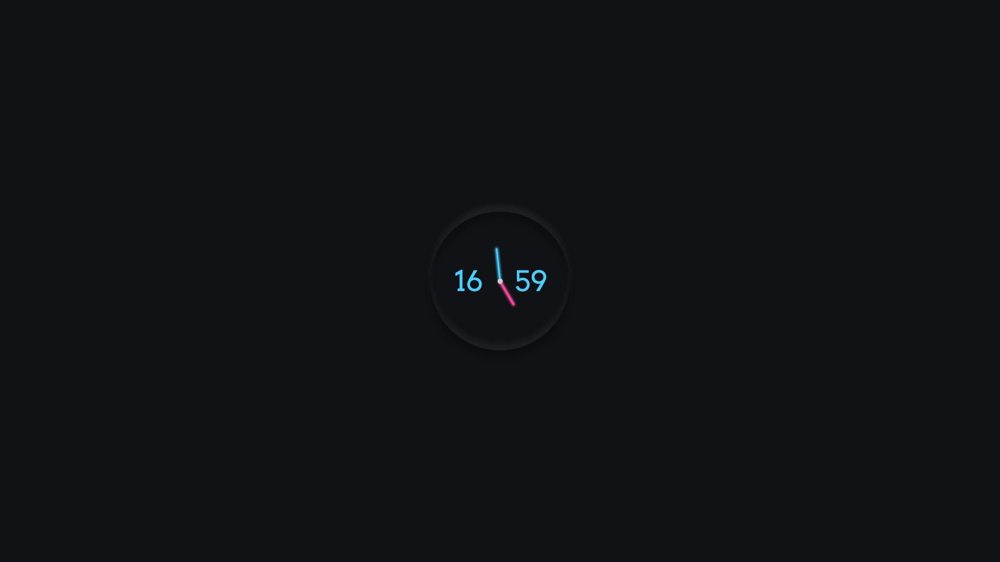

# node-clock-wallpaper

A live clock wallpaper using Node.js



## Usage

Make sure your machine have [node and npm](https://nodejs.org/en/) installed

Clone the repo and `cd` into it then run

```
npm install
npm run start
```

## Run on startup with pm2

```
npm i -g pm2
pm2 startup
pm2 start index.js
pm2 save
```
